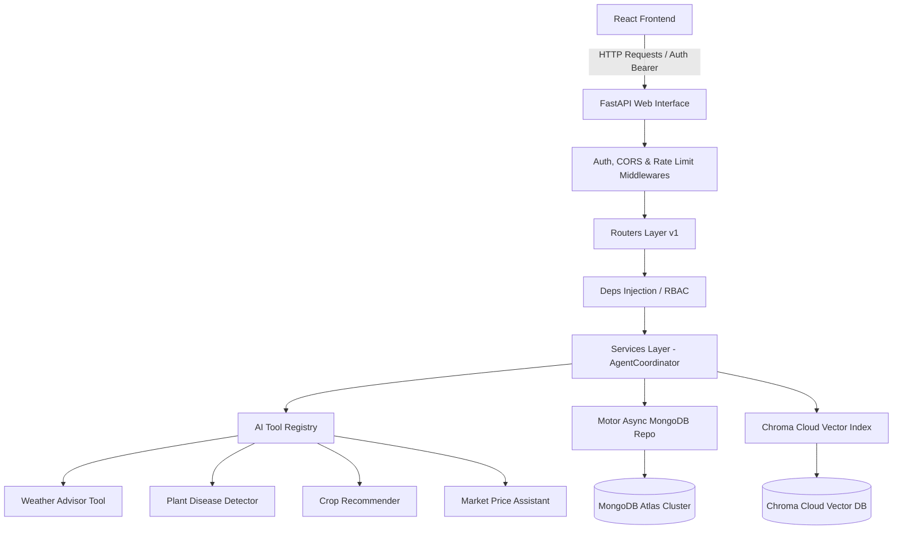

# AgriGenius AI - Enterprise Systems Architecture

This document details the architectural layout, patterns, and design paradigms underlying the **AgriGenius AI** platform.

---

## 1. Architectural Principles

AgriGenius AI is designed using **Enterprise Clean Architecture** and modularity principles. The codebase strictly decouples business layers from framework wrappers, visual components, and hardware resources to achieve high testability, scalability, and code maintenance.

### A. Separation of Concerns
1. **Model Layer**: Defines validation rules and persistent schema models. (Pydantic / Motor aliases).
2. **Repository Layer**: Provides raw storage operations (CRUD) abstracting databases.
3. **Service Layer**: Dictates transactional steps, agent execution, external API adapters.
4. **API Controller Layer**: Exposes Web routes, validates incoming inputs, handles error response formatting.

### B. Dependency Inversion
Higher-level business modules (like the AI Agent Coordinator) do not depend directly on database wrappers or external API clients. Instead, they rely on clean dependencies injected at runtime (e.g. FastAPIs `Depends` mechanism).

---

## 2. Decoupled AI Tool Registry (Supporting 30+ Features)
To prevent the chatbot coordinator from degrading into a massive statement of `if-else` routes when scaling from 4 to 30+ capabilities, AgriGenius implements a dynamic **Tool Registry Pattern**:

- **`BaseAITool`**: An abstract interface requiring a `name`, `description`, `parameter_schema` (a Pydantic model), and an asynchronous `execute()` method.
- **`ToolRegistry`**: A registry repository that loads all tools on startup.
- **Automatic Parameter Verification**: The registry dynamically parses input parameters against the tool's defined Pydantic schema using validation models before firing the execution flow.
- **LLM Function Calling Export**: The registry generates standard JSON schemas of all registered tools, which can be injected directly into the Qwen 3 8B context window.

---

## 3. Database Integrations
- **MongoDB Atlas**: Used for transactional storage (Users, Farmer Profiles, Chat histories, Message logs, and Tool executions audits). Setup utilizes the asynchronous `Motor` driver for high-throughput, non-blocking operations.
- **Chroma Cloud**: Leveraged as a secure vector store for Retrieval-Augmented Generation (RAG) tasks, indexing agricultural guides, disease treatment guidelines, and government scheme documents.

---

## 4. Security Gateway Architecture
1. **JWT Verification**: Strict asymmetric token validations (using PyJWT), supporting Access and Refresh token structures.
2. **Role-Based Access Control (RBAC)**: Fine-grained access control ensuring routes are validated by roles (`Farmer`, `Admin`, `AI_Expert`, `Agriculture_Officer`).
3. **Middleware Protections**:
   - CORS configurations restricting cross-site calls.
   - Secure HTTP headers (CSP, HSTS, XSS protections, frame denials).
   - In-memory sliding-window Rate Limiting to prevent brute force or crawler overloads.

---

## 5. UI/UX Design System Guidelines
The frontend utilizes a hybrid **Tailwind CSS + Material-UI (MUI v6)** styling structure configured with a modern, dark/light synced green visual palette:
- **Glassmorphic Overlays**: Styled panels using light-absorbing white/slate backdrops with `backdrop-filter: blur(16px)` and micro-border lines.
- **Dynamic Renderers**: Message boxes parse bot responses for `tool_calls` parameters. If present, the page dynamically loads custom widgets (e.g., soil compositions meters, weather gauges, diagnosis cards) instead of simple markdown text blocks.
